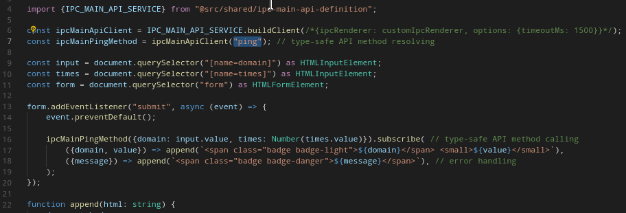

# electron-rpc-api

[](https://travis-ci.org/vladimiry/electron-rpc-api) [](https://ci.appveyor.com/project/vladimiry/electron-rpc-api)

Is a wrapper around the Electron's IPC for building type-safe API based RPC-like interactions.

You describe an API structure and communication channel only once creating an API Service instance and then you share that instance between provider and client. It means that API method names and types of the input/return parameters on the client side are the same as on the provider side, so you get a type-safety on both sides having no overhead in runtime, thanks to TypeScript.

This module provides services for interacting with `ipcMain` and `webview` providers, can be imported like this `import {IpcMainApiService, WebViewApiService} from "electron-rpc-api"`.

## Getting started

`IpcMainApiService` usage example is shown below. It's based on the [example app](example/electron-app), so you can jump there and run the app.

- First of all an API structure needs to be defined ([example/electron-app/src/shared/ipc-main-api-definition.ts](example/electron-app/src/shared/ipc-main-api-definition.ts)):
```typescript
import {ApiMethod, IpcMainApiService} from "electron-rpc-api";

export interface IpcMainApi {
    ping: ApiMethod<{ domain: string, times: number }, { domain: string, value: number }>;
    quitApp: ApiMethod<undefined, never>;
}

export const IPC_MAIN_API_SERVICE = new IpcMainApiService<IpcMainApi>({channel: "some-ipcMain-channel"});
```

- API methods implementation and registration in `main` process using previously created `IPC_MAIN_API_SERVICE` service instance ([example/electron-app/src/main/ipc-main-api.ts](example/electron-app/src/main/ipc-main-api.ts)):
```typescript
import ping from "ping";
import {app} from "electron";
import {map, switchMap, take} from "rxjs/operators";
import {EMPTY, from, interval} from "rxjs";

import {AnyType} from "@src/shared/model";
import {IPC_MAIN_API_SERVICE, IpcMainApi} from "@src/shared/ipc-main-api-definition";

export function register(): IpcMainApi {
    const api: IpcMainApi = {
        ping: ({domain, times}) => interval(1000).pipe(
            take(times),
            switchMap(() => from(ping.promise.probe(domain))),
            map(({alive, avg}: AnyType) => {
                if (!alive) {
                    throw new Error(`Host "${domain}" is unreachable`);
                }
                return {domain, value: Number(avg)};
            }),
        ),
        quitApp: () => {
            app.quit();
            return EMPTY;
        },
    };

    IPC_MAIN_API_SERVICE.registerApi(api);

    return api;
}
```

- And finally calling the API methods in `renderer` process using the same service instance ([example/electron-app/src/renderer/browser-window/index.ts](example/electron-app/src/renderer/browser-window/index.ts)):
```typescript
import xss from "xss";
import "./index.scss";

import {IPC_MAIN_API_SERVICE} from "@src/shared/ipc-main-api-definition";

const ipcMainApiClient = IPC_MAIN_API_SERVICE.buildClient(/*{ipcRenderer: customIpcRenderer, options: {timeoutMs: 1500}}*/);
const ipcMainPingMethod = ipcMainApiClient("ping"); // type-safe API method resolving

const input = document.querySelector("[name=domain]") as HTMLInputElement;
const times = document.querySelector("[name=times]") as HTMLInputElement;
const form = document.querySelector("form") as HTMLFormElement;

form.addEventListener("submit", async (event) => {
    event.preventDefault();

    ipcMainPingMethod({domain: input.value, times: Number(times.value)}).subscribe( // type-safe API method calling
        ({domain, value}) => append(`<span class="badge badge-light">${domain}</span> <small>${value}</small>`),
        ({message}) => append(`<span class="badge badge-danger">${message}</span>`), // error handling
    );
});

function append(html: string) {
    document.body
        .appendChild(document.createElement("div"))
        .innerHTML = xss(html, {whiteList: {span: ["class"], small: []}});
}
```

Method resolving and method calling are type-safe actions here:


